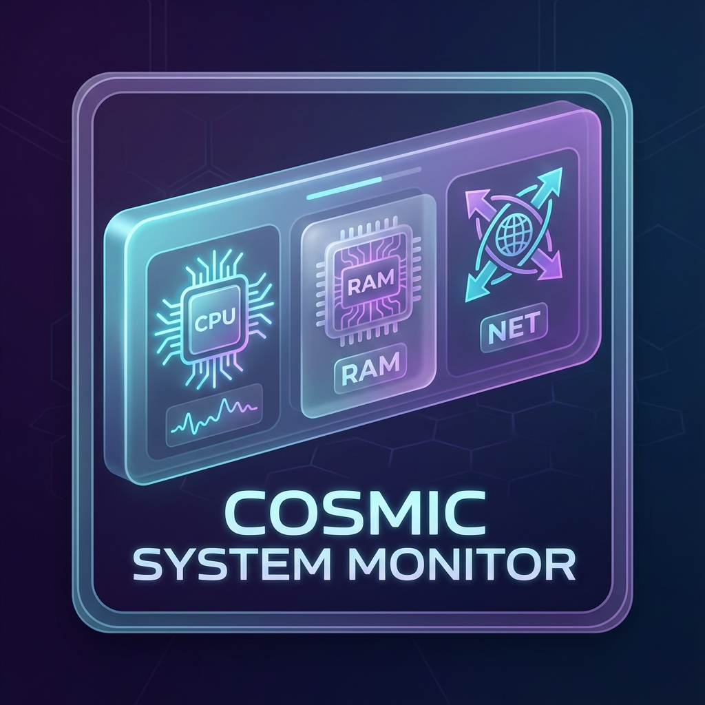

# COSMIC System Monitor Applet



Monitor de sistema limpo e leve para o COSMIC Desktop.

## Instalação Rápida

```bash
git clone https://github.com/marcossl10/cosmic-system-monitor.git
cd cosmic-system-monitor
sudo just install
```

## Funcionalidades
- Uso e Temperatura de CPU, RAM e GPU
- Rede em tempo real (B/s, KB/s, MB/s)
- Visual nativo do sistema COSMIC

---
*Nota: Se a compilação falhar, verifique se você tem o `just`, `rust` e as bibliotecas de sistema instaladas.*
